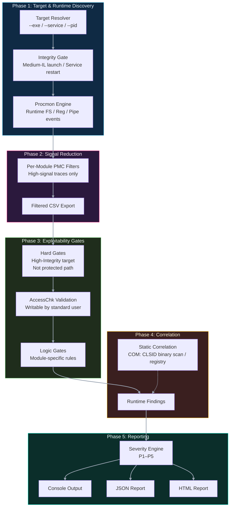

<p align="center">
  
</p>


---
<p align="center">
  
  
  
</p>
<p align="center">
  <strong>Runtime-first privilege escalation and attack surface assessment for Windows thick clients.</strong><br/>
</p>

Anvil is a runtime-first privilege escalation and attack surface assessment tool for Windows thick client applications. Rather than scanning the filesystem blindly, it pairs **Procmon** capture with **Windows AccessCheck** to report only paths that are both observed at runtime *and* confirmed writable by standard users, eliminating the false positive noise that plagues generic enumeration tools.

---

## Contents

- [Key Features](#key-features)
- [How It Works](#how-it-works)
- [Modules](#modules)
- [Requirements](#requirements)
- [Sysinternals Tools](#sysinternals-tools)
- [Installation](#installation)
- [Distribution](#distribution)
- [Usage](#usage)
- [Examples](#examples)
- [Output](#output)
- [Severity Model](#severity-model)
- [Filters](#filters)
- [Disclaimer](#disclaimer)

---

## Key Features

Most thick client assessment tools cover one or two attack classes. Anvil is built around the idea that runtime observation, ACL-verified exploitability, and a wide attack surface should all live in the same targeted run — with a gated pipeline that keeps the output actionable.

### False-Positive Pipeline

Every candidate passes four sequential gates before it is reported.

**Hard Gates**
- Process integrity must be High or SYSTEM IL
- Path must not be inside System32, SysWOW64, or Program Files
- Directory writable by a standard user — verified via Windows `AccessCheck` API

**Module Logic Gates**
- Symlink: disposition flags (`Supersede`, `OverwriteIf`, etc.) + cross-user writability guard
- COM: registry CLSID correlated back to a missing or writable DLL path
- Binary: PATH ordering checked — writable entries appearing *before* System32 only
- Unquoted path: intermediate phantom directories confirmed writable, kernel `.sys` paths excluded

---

## How It Works


1. **Target Resolution**  
   The tool resolves the target to an executable path (from `--exe`, `--service`, or `--pid`). If it is a service, `ServiceInfo` is retrieved with current PID and state.

2. **Procmon Capture**  
   - For a **service**, Procmon is started, then the service is cleanly restarted (with state‑transition waits). The new PID is captured.
   - For a **regular EXE**, the process is launched at **Medium integrity** (using a duplicated Explorer token) to simulate a standard user. The PID is recorded.

   Process integrity level is read **immediately after launch** (while the process is alive) and stored in the context.

3. **Per‑Module Filtered Analysis**  
   Each module requests a filtered CSV export from Procmon using its own `.pmc` filter (stored in `filters/`). The CSV is parsed, and a series of gates are applied:
   - Integrity ≥ High
   - Path not in a protected system directory
   - Directory writable by a standard user (AccessCheck)
   - Additional module‑specific logic (e.g., disposition for symlinks, registry‑to‑file correlation for COM)

4. **Static Correlation**  
   The `com` module performs an additional static pass — scanning the target binary for embedded CLSIDs and checking each against HKLM and HKCU — to surface hijack opportunities not exercised during the capture window. These are flagged with a `[Static Correlation]` tag.

5. **Reporting**  
   Findings are printed to the terminal (with colour coding) and optionally written to JSON or a standalone HTML report.

---

## Architecture 



## Comparison 


| Feature                                           |     **AnviL**    | **Spartacus** | **Robber** | **winPEAS** | **Procmon** |
| ------------------------------------------------- | :--------------: | :-----------: | :--------: | :---------: | :---------: |
| Automated discovery                               |         ✅        |       ✅       |      ✅     |      ✅      |      ❌      |
| **Runtime‑verified discovery**                    |         ✅        |       ❌       |      ❌     |      ❌      |      ✅      |
| Phantom DLL detection                             |         ✅        |       ✅       |      ❌     |      ❌      |      ◐      |
| Search‑order–aware analysis                       |         ✅        |       ❌       |      ❌     |      ❌      |      ❌      |
| ACL‑based writability validation                  |   ✅ (AccessChk)  |       ◐       |      ◐     |    Basic    |      ❌      |
| Per‑module signal filtering                       | ✅ (.pmc filters) |       ❌       |      ❌     |      ❌      |      ❌      |
| False‑positive elimination (gated pipeline)       |         ✅        |       ❌       |      ❌     |      ❌      |      ❌      |
| Service restart & PID recapture                   |         ✅        |       ❌       |      ❌     |      ❌      |      ❌      |
| Medium‑IL user simulation                         |         ✅        |       ❌       |      ❌     |      ❌      |      ❌      |
| DLL hijacking (thick‑client aware)                |         ✅        |       ❌       |      ❌     |      ◐      |      ❌      |
| COM hijacking correlation                         |         ✅        |       ❌       |      ❌     |      ❌      |      ❌      |
| Named pipe ACL / impersonation analysis           |         ✅        |       ❌       |      ❌     |      ❌      |      ❌      |
| Symlink / junction abuse detection                |         ✅        |       ❌       |      ◐     |      ◐      |      ❌      |
| Memory secrets (live process scan)                |         ✅        |       ❌       |      ❌     |      ◐      |      ❌      |
| PE security / mitigation analysis                 |         ✅        |       ❌       |      ❌     |      ◐      |      ❌      |
| Privilege‑escalation **assessment** (non‑exploit) |         ✅        |       ✅       |      ✅     |      ❌      |      ❌      |
| Automated exploitation                            |         ❌        |       ✅       |      ✅     |      ❌      |      ❌      |
| Confidence / severity scoring                     |     ✅ (P1–P5)    |       ❌       |      ❌     |      ❌      |      ❌      |
| Target‑specific analysis (exe / svc / pid)        |         ✅        |       ❌       |      ❌     |      ❌      |      ✅      |
| Structured reporting (JSON / HTML)                |         ✅        |       ❌       |      ❌     |     TXT     |      ❌      |
| **Self‑contained binary distribution**            |         ✅        |       ✅       |      ✅     |      ✅      |      ✅      |

***


---

## Modules

| Module | Flag | What It Checks |
|--------|------|---------------|
| **DLL Hijacking** | `dll` | CreateFile events for `.dll` — phantom DLLs and loaded DLLs in writable directories |
| **COM Hijacking** | `com` | COM server registry keys writable by standard users; binary scan for ProgIDs |
| **Binary Hijacking** | `binary` | CreateFile events for `.exe` — phantom EXE planting and writable EXE directories |
| **Insecure Configs** | `configs` | Config file access (`.ini`, `.xml`, `.json`, `.yaml`, etc.) from writable directories |
| **Install Directory** | `installdir` | Root ACL, elevation-manifest EXEs, and writable subdirectories |
| **Memory Strings** | `memory` | Live process memory scan for credentials, tokens, API keys, JWTs, connection strings |
| **Symlink Attacks** | `symlink` | Junction and symlink vectors in user-writable temp / appdata paths |
| **Unquoted Service Path** | `unquoted` | Services with unquoted ImagePaths where intermediate phantom directories are writable |
| **Registry Privesc** | `registry` | Registry keys writable by standard users that control service/application behaviour |
| **PE Security Flags** | `pesec` | Missing ASLR, DEP, CFG, SafeSEH, and Authenticode on target binaries |
| **Named Pipe ACL** | `pipes` | Named pipes with permissive DACLs or impersonation-capable ACEs |

All Procmon-based modules require a matching `.pmc` filter file in the `filters/` directory (see [Filters](#filters)).

---

## Requirements

### Python

- Python **3.8 or later**
- Must be run as **Administrator**
- Windows 10 / Server 2016 or newer

### Python Packages

Anvil self-installs its two dependencies on first run. You can also install them manually:

```
pip install rich pefile
```

```
pip install rich>=13.0 pefile>=2023.2.7
```

### Sysinternals Tools

See the [Sysinternals Tools](#sysinternals-tools) section below.

---

## Sysinternals Tools

Anvil uses three Sysinternals binaries. All are automatically downloaded if not found, and stored in `sysinternals/` inside the tool directory.

| Binary | Used By | Download |
|--------|---------|----------|
| `Procmon64.exe` | All Procmon-based modules | [ProcessMonitor.zip](https://download.sysinternals.com/files/ProcessMonitor.zip) |
| `handle.exe` | Named Pipe ACL module | [Handle.zip](https://download.sysinternals.com/files/Handle.zip) |
| `accesschk.exe` | Named Pipe ACL module — pipe DACL enumeration | [AccessChk.zip](https://download.sysinternals.com/files/AccessChk.zip) |

> **Note:** Directory and file writability checks across all other modules use the Windows `AccessCheck` API directly via `ctypes` — no binary required. `accesschk.exe` is only needed for named pipe DACL enumeration in the `pipes` module, where reading pipe security descriptors via the raw API would require reconstructing ACE structures that `accesschk` already surfaces cleanly.

### Providing Your Own Binaries

If the machine has no internet access or you already have the Sysinternals Suite downloaded, point Anvil at your copies — they will be **copied into `sysinternals/`** automatically for all future runs:

```
python anvil.py --exe target.exe \
    --procmon  "D:\Tools\SysinternalsSuite\Procmon64.exe" \
    --handle   "D:\Tools\SysinternalsSuite\handle.exe" \
    --accesschk "D:\Tools\SysinternalsSuite\accesschk64.exe"
```

After the first run with these flags the binaries are cached in `sysinternals/` and the flags are no longer needed.

### Offline / Air-Gapped Environments

1. Download the full [Sysinternals Suite ZIP](https://download.sysinternals.com/files/SysinternalsSuite.zip) on a connected machine.
2. Extract and copy `Procmon64.exe`, `handle.exe`, and `accesschk.exe` into a `sysinternals/` folder at the tool root.
3. Run Anvil normally — it will find them automatically.

---

## Installation

```bash
# Clone the repository
git clone https://github.com/yourorg/anvil.git
cd anvil

# (Optional) Create a virtual environment
python -m venv .venv
.venv\Scripts\activate

# Run — dependencies auto-install on first launch
python anvil.py --help
```

> **Tip:** Always launch your terminal with **Run as Administrator** before running Anvil.

---

## Distribution

### Compile to a standalone executable

Requires PyInstaller (`pip install pyinstaller`):

```
python -m PyInstaller --onefile --console --add-data "filters;filters" --add-data "modules/logo.png;." --icon .\modules\logo.ico --name Anvil anvil.py
```

The output binary will be at `dist\Anvil.exe`. No Python installation is required on the target machine.

> **Note:** Windows SmartScreen may block the compiled executable on first run since it is unsigned. 

### Pre-built binary

A pre-built `Anvil.exe` is available on the [Releases](../../releases) page — if trusting random binaries from the internet is in your threat model.

| Version | SHA-256 | VirusTotal |
|---------|---------|------------|
| V1.0.0 | — | — |
 
> SHA-256 can be verified with `certutil -hashfile Anvil.exe SHA256` (Windows) or `sha256sum Anvil.exe` (Linux).

---

## Usage

```
python anvil.py [--exe PATH | --service NAME | --pid PID] [options]
```

### Target (one required)

| Flag | Description |
|------|-------------|
| `--exe PATH` | Target executable. Launched at Medium IL for Procmon capture. |
| `--service NAME` | Windows service name. Exe resolved from registry; service restarted to capture startup. |
| `--pid PID` | Attach to an already-running process. Procmon captures ongoing activity. |

### Module Selection

| Flag | Default | Description |
|------|---------|-------------|
| `--modules LIST` | `all` | Comma-separated list of modules to run. |

Module names: `dll`, `com`, `registry`, `binary`, `configs`, `installdir`, `memory`, `symlink`, `unquoted`, `pesec`, `pipes`

### Sysinternals Paths

| Flag | Description |
|------|-------------|
| `--procmon PATH` | Path to `Procmon64.exe`. Copied to `sysinternals/` and auto-used thereafter. |
| `--handle PATH` | Path to `handle.exe`. Copied to `sysinternals/` and auto-used thereafter. |
| `--accesschk PATH` | Path to `accesschk.exe`. Copied to `sysinternals/` and auto-used thereafter. |

### Capture

| Flag | Default | Description |
|------|---------|-------------|
| `--procmon-runtime SEC` | `30` | Procmon capture window in seconds. Increase for slow-starting apps. |

### Output

| Flag | Default | Description |
|------|---------|-------------|
| `--report FILE` | — | Generate a report — extension determines format: `.json` for JSON, `.html` (or any other) for a self-contained HTML report. |
| `--verbose` | off | Print full finding detail blocks in the terminal. |
| `--no-color` | off | Disable ANSI colour output. |
| `--skip-authenticode` | off | Skip Authenticode signature checks (faster for large install dirs). |
| `--scan-install-dir` | off | Include all DLLs in the install directory in PE security checks. |
| `--memory-strings STR,...` | — | Additional comma-separated strings to search for in process memory. |

---

## Examples

**Basic scan of a desktop application:**
```
python anvil.py --exe "C:\Program Files\MyApp\myapp.exe" --report report.html
```

**Longer capture window for a slow-starting app:**
```
python anvil.py --exe "C:\Program Files\MyApp\myapp.exe" --procmon-runtime 60 --scan-install-dir
```

**Target a Windows service:**
```
python anvil.py --service MyAppSvc --modules dll,binary,unquoted,registry
```

**Attach to an already-running process:**
```
python anvil.py --pid 4872 --report report.html --verbose
```

**Run specific modules only:**
```
python anvil.py --exe "C:\App\app.exe" --modules dll,symlink,unquoted
```

**Scan process memory for extra custom strings:**
```
python anvil.py --exe "C:\App\app.exe" --modules memory --memory-strings "InternalSecret,DevPassword"
```

**Air-gapped machine — provide Sysinternals manually (copied once):**
```
python anvil.py --exe "C:\App\app.exe" --procmon "E:\Sysint\Procmon64.exe" --handle "E:\Sysint\handle.exe" --accesschk "E:\Sysint\accesschk.exe"
```

---

## Output

### Terminal

Colour-coded per severity with optional `--verbose` detail blocks. Requires the `rich` package (auto-installed).

### JSON (`--report findings.json`)

Machine-readable array of finding objects:
```json
[
  {
    "severity": "P1",
    "module": "DLL Hijacking",
    "message": "[System→User] Phantom DLL: version.dll",
    "detail": "DLL name   : version.dll\nAttempted  : C:\\ProgramData\\MyApp\\version.dll\n..."
  }
]
```

### HTML (`--report report.html`) [Recommended]

Self-contained single-file report with:
- Executive summary and severity breakdown
- Per-module finding tables
- Filtering by severity or vulnerability class
- Full detail on expand
- Scan metadata (target, timestamps, integrity level)


---

## Severity Model

| Level | Label | Typical CVSS | Meaning |
|-------|-------|-------------|---------|
| **P1** | Critical | 8.0 – 8.8 | Auto-triggered privilege escalation (no user interaction) |
| **P2** | High | 7.0 – 7.9 | Exploitable with user interaction or weaker trigger |
| **P3** | Misconfiguration | 4.0 – 6.9 | Unquoted paths, missing mitigations — not directly exploitable |
| **P4** | Low Impact | 0.1 – 3.9 | Informational vectors with limited real-world impact |
| **P5** | Informational | N/A | Context and observations, not vulnerabilities |


---

## Filters

All `.pmc` filter files are included in the `filters/` directory of the repository — no setup required. Procmon-based modules will pick them up automatically.

| File | Module | Key Filter Rules |
|------|--------|-----------------|
| `filters/dll.pmc` | DLL Hijacking | `Operation is CreateFile`, `Path ends with .dll` |
| `filters/binary.pmc` | Binary Hijacking | `Operation is CreateFile`, `Path ends with .exe` |
| `filters/config.pmc` | Insecure Configs | `Operation is CreateFile` (extension filter in code) |
| `filters/com.pmc` | COM Hijacking | `Operation is RegQueryKey`, `Path contains HKLM` |
| `filters/symlink.pmc` | Symlink Attacks | `Operation is CreateFile` |

### Recreating a filter
 
If a filter file is lost or corrupted, recreate it in Procmon using the rules above: **Filter → Filter…** to configure the conditions, then **File → Export Configuration…** and save to `filters/<name>.pmc`.

Anvil will automatically pick up the `.pmc` file on the next run for that module.

---
 
## Disclaimer
 
Anvil is designed for security research, bug bounty hunting, and authorized penetration testing engagements. Use it only on systems you own or have explicit written permission to assess.
 
**Operational notes**
 
- Anvil restarts services during capture — this briefly interrupts the target service on the assessed machine
- The memory module attaches to a live process, ensure this is acceptable in the target environment before running.
- Run as Administrator is required — ensure this aligns with the rules of engagement for the assessment.
